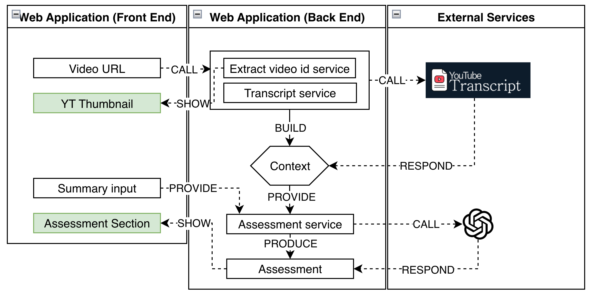

# Dr. Luist

A clean, modern web app for practicing listening comprehension and getting structured feedback on what you heard.

## What you can do
- Paste a video link and detect its ID automatically.
- Write a short summary or bullet points of what you understood.
- Get a full assessment with overall score and a metric breakdown.
- Review "What was good" and "Areas to improve" guidance.
- Read a grammar assessment with a quality score and detailed feedback.

## Folder structure
```
drluist/                            # Repository root
├── backend/                        # Backend service code
│   ├── src/                        
│   │   └── app/                    
│   │       ├── assessment.py       # Assessment orchestration and utilities
│   │       ├── assessment_model.py # Scoring/model logic
│   │       ├── context.py          # Request/session context helpers
│   │       ├── main.py             # FastAPI app entry point
│   │       └── youtube.py          # YouTube ID and transcript helpers
│   └── tests/                     
│       ├── test_transcript_pipeline.py # Transcript pipeline tests
│       └── test_yt_id.py           # YouTube ID parsing tests
│   
├── frontend/                       # React + Vite frontend
│   ├── index.html                  # HTML entry point
│   └── src/                        # Frontend source code
│       ├── App.jsx                 # App root component
│       ├── main.jsx                # React entry point
│       ├── index.css               # Global styles and Tailwind setup
│       ├── assets/                 # Static assets
│       │   ├── LinkedIn_icon.svg   
│       │   └── linkedin-svgrepo-com.svg 
│       ├── pages/                  # Page-level components
│       │   ├── About.jsx           # About page
│       │   └── HomePage.jsx        # Main landing page
│       └── components/             # Reusable UI components
│           ├── AssessmentComponents.jsx  # Metric breakdown cards
│           ├── AssessmentSection.jsx     # Assessment section layout
│           ├── BackToTheTopButton.jsx    # Scroll-to-top control
│           ├── FurtherDetailsSection.jsx # Additional details section
│           ├── GoodCard.jsx              # "What was good" card
│           ├── GrammarCard.jsx           # Grammar feedback card
│           ├── ImprovementCard.jsx       # "Areas to improve" card
│           ├── LanguageSelector.jsx      # Language selector controls
│           ├── Navbar.jsx                # Top navigation bar
│           ├── OverallAssessmentCard.jsx # Overall score card
│           ├── Pitch.jsx                 # Hero headline/subtitle
│           ├── SourceCard.jsx            # Video source input card
│           └── SummaryCard.jsx           # Summary input card
└── README.md                      # Project overview and setup
```
